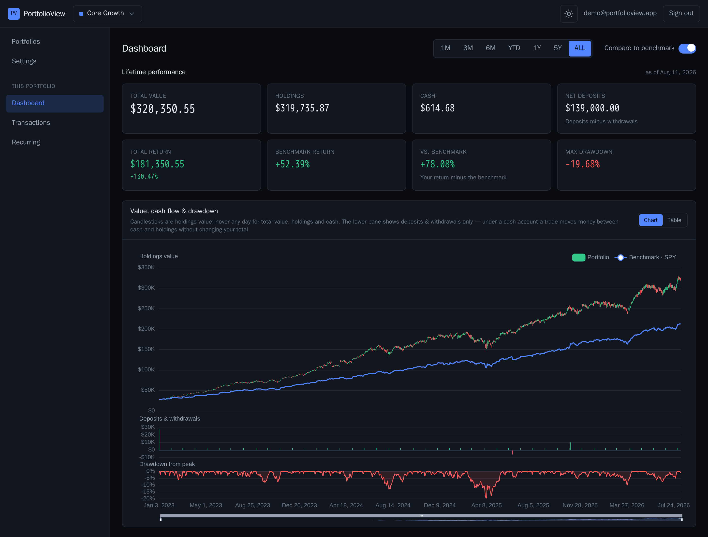
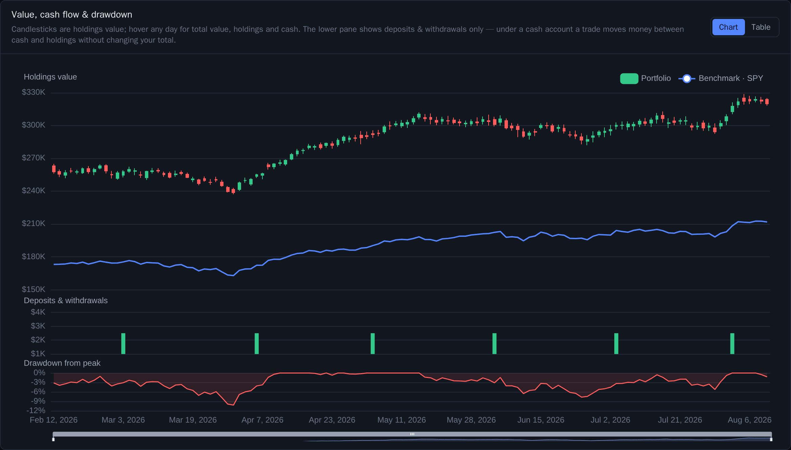
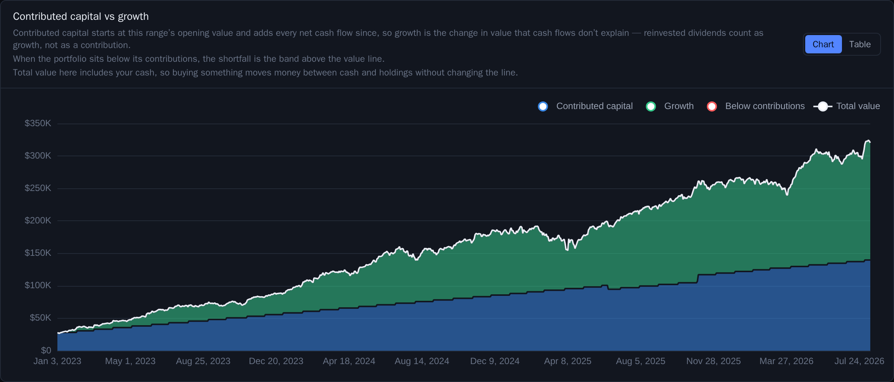
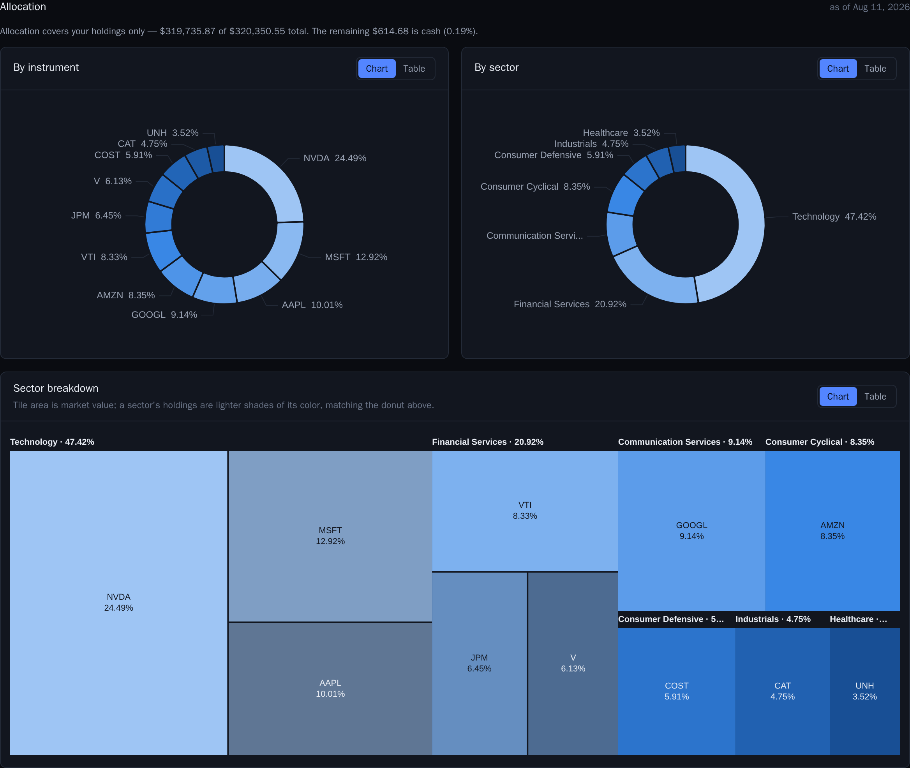
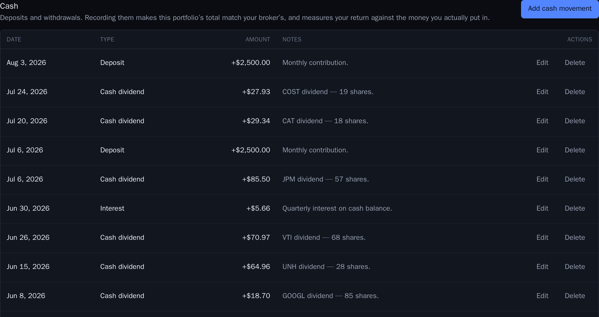
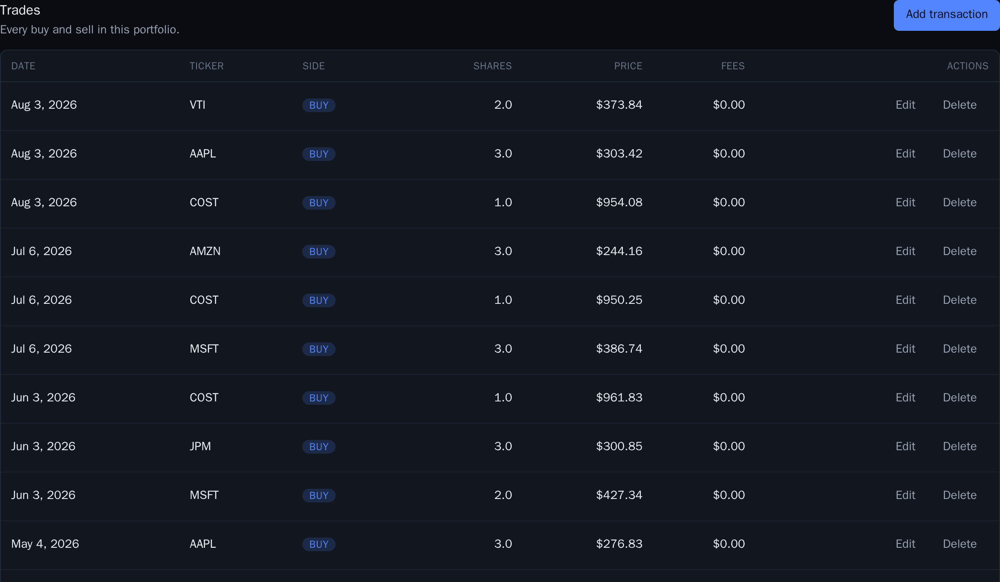
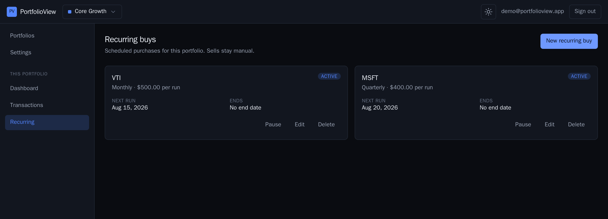
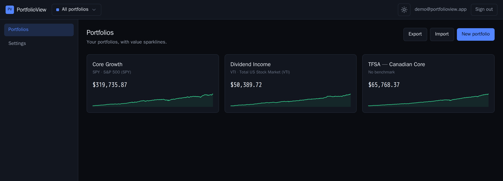
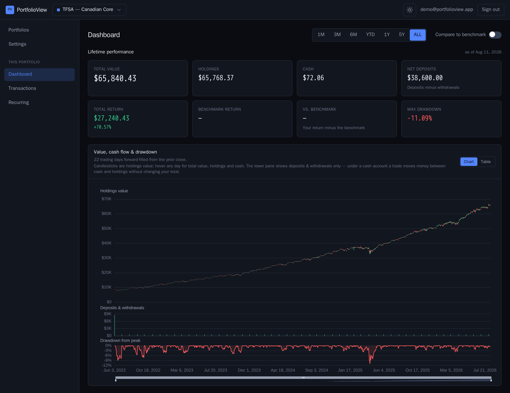

# PortfolioView

Track personal stock portfolios and see what actually drove the number: a candlestick chart of
total portfolio value, a cash-flow-matched benchmark that answers *"would SPY have done better
with my exact deposits?"*, allocation and sector breakdowns, a real cash ledger, and recurring
transactions that materialize themselves.


<sub>Same tour as an [MP4](docs/media/tour.mp4) (sharper, a fifth of the size). Everything below is
the real app against the demo account — see [Demo data](#demo-data-and-screenshots).</sub>

**Stack:** Rails 8 (JSON API, Solid Queue/Cache) · Vue 3 + Vite + TypeScript · PostgreSQL 16 ·
Apache ECharts · PrimeVue + Tailwind. Market data: Tiingo (EOD prices, splits, dividends), FMP
(sector metadata), Yahoo (Canadian listings).

## What it looks like

### One chart, three linked panes



Value, cash flow and drawdown share one x-axis and one crosshair, so a dip in the top pane can be
read against the money that moved that day. Candles are **holdings** value; cash rides alongside
rather than inside them, because a deposit drawn as a tall green candle would lie about
performance.

Hover any trading day and every pane answers at once:



The high and low are honest bounds, not observations — the highs of different holdings need not
occur at the same moment, and the tooltip says so rather than implying an intraday range the EOD
data cannot support.

### Contributed capital versus growth



The staircase is money you put in. Everything above it is the market. When a portfolio falls below
what was contributed, the shortfall is drawn as a band above the value line instead of quietly
disappearing.

### Where the money actually is



Instrument and sector donuts share a palette with the treemap below them, so the same holding is
the same colour in all three. Allocation covers holdings only, and the caption states how much of
the total is cash rather than silently omitting it.

### Cash is a first-class ledger



Deposits, withdrawals, dividends, interest, fees and tax. Only deposits and withdrawals count as
contributions — a broker dividend is *return*, not money you added, and treating it as a
contribution would understate your gain. Recording cash is optional: a portfolio with no cash rows
behaves exactly as it did before the ledger existed.

### Trades and recurring buys





Recurring rules materialize into real transactions on schedule, and a rule created today never
backfills months of trades you did not make.

### Multiple portfolios, including Canadian listings





TSX / TSX-V / CBOE Canada listings are priced through a separate provider, and the dashboard says
so when it has had to forward-fill a day. The CAD book carries **no benchmark on purpose**: the
curated list is USD and there is no FX conversion in v1, so an edge number there would be
confidently wrong.

## Demo data and screenshots

The account above is generated, and the distinction worth stating is:

- **The trades are invented.** A fixed schedule of monthly contributions, deterministic buys, one
  trim, one funded withdrawal.
- **Every price is real.** Each trade is priced from the actual `daily_prices` close for its date,
  and splits and dividends are replayed as they happened. So the returns, the drawdown, the
  benchmark edge and the shape of every chart are what the app genuinely computes over real market
  history — not numbers chosen to look good. The dividend-income portfolio in the demo *trails* its
  benchmark, because that is what the data says.

Reproduce it on your own stack:

```sh
docker compose exec web ./bin/rails demo:instruments   # create the symbols; price backfill is async
docker compose exec web ./bin/rails demo:seed          # three portfolios, priced from real history
```

`demo:seed` is idempotent (it rebuilds the demo user's portfolios) and deterministic, so a re-run
after a price refresh reproduces the same screenshots. It refuses to run against a symbol whose
history has not been backfilled rather than quietly building a portfolio worth zero. Sign in as
`demo@portfolioview.app` / `demo-portfolio-2026`.

The media itself is captured by two scripts, so it can be regenerated rather than re-shot by hand:

```sh
# Stills, dark theme, 2x
docker compose --profile e2e run --rm e2e \
  bash -c "npm install --no-audit --no-fund && node capture-readme.mjs"

# The animated tour (needs ffmpeg, which the Playwright image does not ship)
docker compose --profile e2e run --rm e2e \
  bash -c "apt-get update -qq && apt-get install -y -qq ffmpeg && node capture-tour.mjs"
```

Both write to `e2e/capture-out/`; copy what you want into `docs/media/`. Neither is part of the e2e
suite — they are standalone scripts precisely so they never run as tests.

## Running locally (development)

```sh
docker compose up
```

- App: http://localhost:3000 (Rails) · http://localhost:5173 (Vite dev server, proxies /api)
- Postgres: localhost:5433 (user/password: `portfolio`) — host port 5433, not 5432, because
  5432 is commonly held by another local Postgres. In-network services still use `db:5432`.

First run installs gems and node modules into named volumes and prepares the databases.

## Production (local deploy)

One `web-prod` container (Rails in production mode, the Vue SPA served from the same origin,
Solid Queue embedded in Puma, fronted by Thruster) plus one `db-prod` Postgres container with
its own named volume. Both live behind the compose `production` profile, so they never start
with a plain `docker compose up`.

### Bootstrap from a clean checkout

```sh
# 1. Configure secrets. Production has NO defaults for these — a blank value
#    fails closed rather than booting with a dev-shaped secret.
cp .env.example .env
#    Then fill in, in .env:
#      SECRET_KEY_BASE=$(openssl rand -hex 64)
#      APP_DATABASE_PASSWORD=$(openssl rand -hex 24)
#      INVITE_CODE=<your own value>       # blank => registration stays closed
#      TIINGO_API_KEY / FMP_API_KEY / TWELVE_DATA_API_KEY as available
#      INTERNAL_API_TOKEN=$(openssl rand -hex 32)
#        Optional, and blank => the /api/internal namespace stays CLOSED.
#        Set it only if you want to trigger a sync from cron or curl; the
#        Settings "Sync now" button uses your session and needs no token.
#        Note a blank value makes the endpoint answer 401 to every request,
#        including a correct token — that is fail-closed, not a bug.

# 2. Build the image (multi-stage: `npm ci && npm run build`, then Rails) and
#    start both services. Naming the services is what keeps the dev containers,
#    which have no profile and would fight over :3000, out of the run.
docker compose --profile production up --build -d db-prod web-prod

# 3. Watch the first boot. bin/docker-entrypoint clears any stale
#    tmp/pids/server.pid and runs `bin/rails db:prepare` before starting the
#    server. That creates app_production plus the app_production_queue /
#    _cache / _cable databases, loads the schema, and — because the database is
#    brand new — runs db/seeds.rb for the benchmark list (SPY, VTI, QQQ).
#    There is no separate migrate or seed step on a fresh volume.
docker compose --profile production logs -f web-prod
```

Re-running the seeds later (they are idempotent) if you ever need to:

```sh
docker compose --profile production exec web-prod ./bin/rails db:seed
```

The app is then at **http://localhost:3000** — deep links such as
`http://localhost:3000/portfolios/1` are served by the SPA catch-all route, so a refresh or a
bookmarked URL boots the client router instead of 404ing.

Useful follow-ups:

```sh
docker compose --profile production ps                 # health status
docker compose --profile production restart web-prod   # data survives: named volume
docker compose --profile production down               # stop, keep the volume
docker compose --profile production down -v            # stop AND destroy the data
```

Notes:

- Thruster listens on port 80 inside the container and proxies to Puma; compose publishes it
  as `3000:80`. `db-prod` publishes no host port at all.
- The hashed Vite assets under `public/assets` are served with a one-year cache; the SPA shell
  (`index.html`) is served by `SpaController` with `Cache-Control: no-store`, so a rebuilt
  image is picked up on the next page load rather than a year later.
- Never run the dev stack and the production profile at the same time — both want
  `localhost:3000`.

## Design and contributing

The full design — schema, split-handling model, frozen API contract, milestones — lives in
[docs/PLAN.md](docs/PLAN.md). Read it before contributing; the split math and API contract
are load-bearing decisions. [docs/API_SHAPES.md](docs/API_SHAPES.md) records what the API
actually returns, verified against live responses.

Work is tracked as GitHub issues labeled by specialist agent (`agent:backend-expert`,
`agent:database-expert`, `agent:ui-expert`, `agent:tester`, `agent:project-manager`),
grouped into milestones M0–M9. Agent definitions live in `.claude/agents/`.

**AI agents working in this repo**: start with [CLAUDE.md](CLAUDE.md) (environment gotchas,
commit/merge conventions) and [docs/STATUS.md](docs/STATUS.md) (live milestone/issue
tracker), then PLAN.md and API_SHAPES.md.

## Secrets

API keys (Tiingo, FMP, Twelve Data) go in `.env`, which is gitignored — see `.env.example` for the
template. The test environment blanks every provider key on purpose, so the suite can never
silently depend on a real network call.
